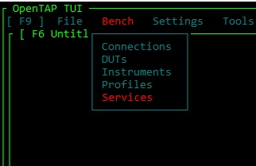
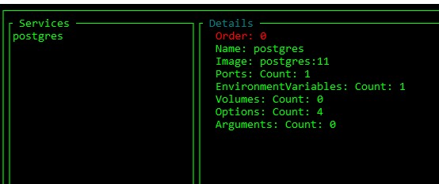
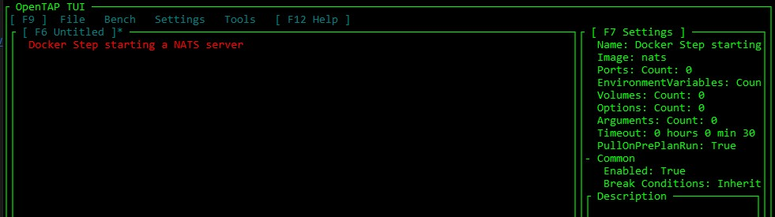

# OpenTAP Docker Services

The OpenTAP Docker is a package that allows you to start docker containers from within OpenTAP. 
Either as a service that is started before the test starts, or as a step in the test sequence.

## Features
- Custom Docker Bridge Network. Allows communication between containers. 
- Publish ports
- Mount volumes
- Specify Arguments
- Specify Environment variables
- Specify Docker Options (except for network)

## Usage

### Service
Services are Docker containers that allows your to host services that you might need to test or operate your application in a workflow. For example, your test plan might need a database or message bus before starting.

Services are started before the test plan starts and stopped after the test plan is finished.

 

### TestStep
A Docker step allows you to start a docker container during the test plan. This can be used to start a container that you need to test or operate your application in a workflow. For example, your workflow might need during test, like a database or message bus.

